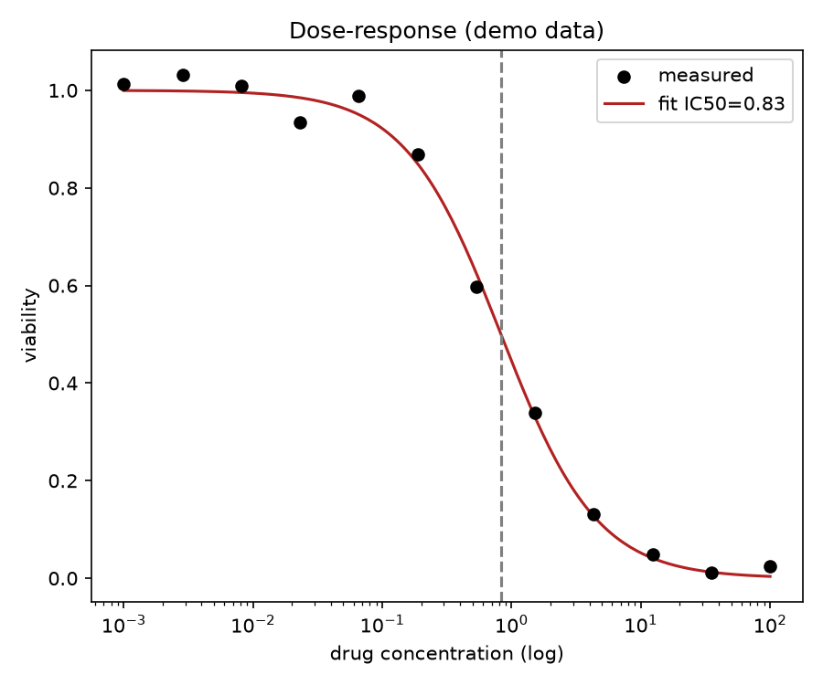

# Dose Response Ic50 Curve

Every drug-screening result comes down to one number: the dose that kills half the cells. Getting that IC50 wrong — by eyeballing instead of fitting — invalidates the whole comparison.

## Why This Matters

IC50 is how you rank drug candidates and compare potencies. You cannot read it reliably off scattered points; you fit a sigmoid (Hill) curve to the dose-response and read the inflection. A proper fit also tells you the slope, which flags weird pharmacology your eyes would miss.

## How It Works

1. Measure viability across a range of drug concentrations.
2. Fit a Hill sigmoid to the points.
3. Read IC50 off the fitted curve.

## What the Demo Shows



The demo generates noisy dose-response data and fits the curve. The measured points scatter, but the fitted sigmoid pins the IC50 precisely (dashed line) — the reproducible number you would report and rank drugs by.

## Run It

```bash
pip install -r requirements.txt
python demo.py
```

> Demonstrated on synthetic data, so it's fully reproducible with no external downloads.
